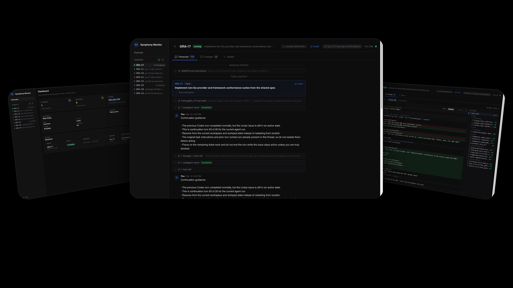

# Symphony UI

UI for the [`openai/symphony`](https://github.com/openai/symphony) runtime.

Symphony UI is a standalone React frontend for operators who want to watch live Symphony runs, inspect the full per-issue transcript, and review git changes in each issue workspace without dropping into the terminal first.



## What It Is

This project sits beside a running Symphony runtime and turns its local HTTP API into an opinionated operator console.

It is built for the workflow where Symphony is coordinating issue work across local workspaces and Codex sessions, and you need to answer questions like:

- Which issues are active right now?
- Which session is spending tokens or backing off?
- What did the agent and tools actually do on a given issue?
- What changed in the workspace: committed, staged, unstaged, or untracked?

## What You Can See

- Dashboard with active sessions, retries, token totals, runtime totals, and upstream rate-limit state
- Issue sidebar showing running, waiting, and completed issue workspaces
- Conversation view with transcript entries for user messages, assistant output, commentary, tool calls, subagent notifications, and `AGENTS.md` / ticket context markers
- Diff view with committed, staged, unstaged, and untracked workspace changes
- Details for branch, workspace path, recent events, retry state, and quick `codex resume` copy helpers

## How To Use It

1. Start the Symphony runtime from [`openai/symphony`](https://github.com/openai/symphony) so the local API is available.
2. By default, Symphony UI expects the runtime at `http://127.0.0.1:4041`.
3. Install the frontend toolchain:

   ```bash
   mise install
   mise run install
   ```

4. Start the UI:

   ```bash
   mise run dev
   ```

5. Open `http://127.0.0.1:5173`.
6. Use the dashboard to spot active work, then click any issue in the sidebar to drill into its transcript, diff, and details.

If your Symphony API is not on `127.0.0.1:4041`, set `VITE_SYMPHONY_API_BASE_URL` before starting Vite.

## Local Development

Available `mise` tasks:

- `mise run install`
- `mise run dev`
- `mise run lint`
- `mise run test`
- `mise run build`
- `mise run check`

The dev server proxies `/api/*` requests to the Symphony runtime, so local development does not need extra CORS setup.

## Routes

- `/` overview dashboard
- `/issues/:issueIdentifier` issue detail with transcript, changes, and details tabs

## Stack

- React 19
- TypeScript
- Vite
- `react-router-dom`
- `lucide-react`
- Vitest + Testing Library

## Design Source

The repo keeps its Pencil source at `design/symphony-observability.pen`.

## License

Apache 2.0. See [`LICENSE`](LICENSE).
